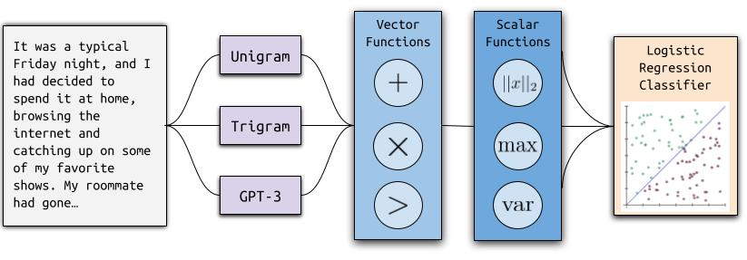

# Ghostbuster: Detecting Text <i>Ghostwritten</i> by Large Language Models <a href="https://arxiv.org/abs/2305.15047">[paper]</a> <a href="https://ghostbuster.app">[demo]</a> <a href="https://github.com/vivek3141/ghostbuster-data">[data]</a>

We introduce Ghostbuster, a state-of-the-art system for detecting AI-generated text. Our method works by passing documents through a series of weaker language models, running a structured search over possible combinations of their features, and then training a classifier on the selected features to predict whether documents are AI-generated. 

<p align="center">

</p>

Crucially, Ghostbuster does not require access to token probabilities from the target model, making it useful for detecting text generated by black-box models or unknown model versions.

We compare Ghostbuster to a variety of existing detectors, including DetectGPT and GPTZero, as well as a new RoBERTa baseline. Ghostbuster achieves 99.0 F1 when evaluated across domains, which is 5.9 F1 higher than the best preexisting model. It also outperforms all previous approaches in generalization across writing domains (+7.5 F1), prompting strategies (+2.1 F1), and language models (+4.4 F1).

## Datasets

In conjunction with our model, we release three new datasets of human- and AI-generated text as detection benchmarks in the domains of student essays, creative writing, and news articles. These can be found under the `data` folder. Each dataset also contains a `logprobs` folder, which consists of files of the form `X-ada.txt` and `X-davinci.txt`, corresponding to token-wise logprobs when running the document `X.txt` under ada and davinci.

We note that any usages of our data prior to Nov 14 2023 would likely be using our old dataset. In order to access this, please revert to the commit hash `604d85c`.

# Installation

Each of our files are pickled with `python3.10`, so we highly reccomend creating a new conda environment as follows:

```
conda create -n ghostbuster python=3.10
conda activate ghostbuster
```

Then, clone the reponsitory:

```
git clone git@github.com:vivek3141/ghostbuster.git
cd ghostbuster
```

Lastly, install the dependencies and the package:

```
pip install -r requirements.txt
pip install -e .
```

You may also need to open a `python` shell to install the following nltk `brown` model:
```python
import nltk
nltk.download('brown')
```

# Usage

In order to run a standalone text through Ghostbuster, we provide a `classify.py` file with the following usage:

```
python3 classify.py --file INPUT_FILE_HERE --openai_key OPENAI_KEY
```

To run the experiment files, create a file called `openai.config` in the main directory with the following template:
```javascript
{
    "organization": ORGANIZATION,
    "api_key": API_KEY
}
```

Then, you must generate the cached symbolic data file. This consists of a feature vector for every single feature found through our "symbolic search" method. Running these commands will create binary files in the root directory:
```
python train.py --generate_symbolic_data_four
python train.py --generate_symbolic_data_eval
```
These commands should take a couple hours to run! Then, you can run any of the experiments listed in the `run.py` file.

## Disclaimer

Ghostbuster’s training data, which consists of news, student essay, and creative writing data, is not representative of all writing styles or topics and contains predominantly British and American English text. If you wish to apply Ghostbuster to real-world cases of potential off-limits usage of text generation, such as identifying ChatGPT-written student essays, be wary that incorrect predictions by Ghostbuster are particularly likely in the following cases:

<ul>
<li> For shorter text
<li> In domains that are further from those on which Ghostbuster was trained (e.g., text messages)
<li> For text in varieties of English besides American and British English, or in non-English languages
<li> For text written by non-native speakers of English
<li> For AI-generated text that has been edited or paraphrased by a human
</ul>

No AI-generated text detector is 100% accurate; we strongly discourage incorporation of Ghostbuster into any systems that automatically penalize students or other writers for alleged usage of text generation without human intervention. Privacy: Please be aware that all inputs to Ghostbuster are sent to the OpenAI API, and we also save the inputs for internal testing purposes. Though we will not distribute the data publicly, we cannot guarantee the privacy of any inputs to Ghostbuster.